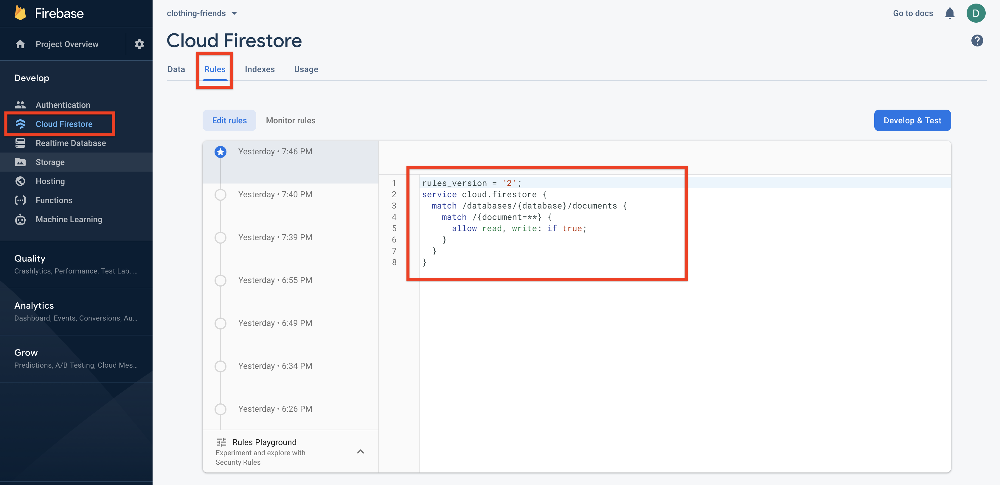
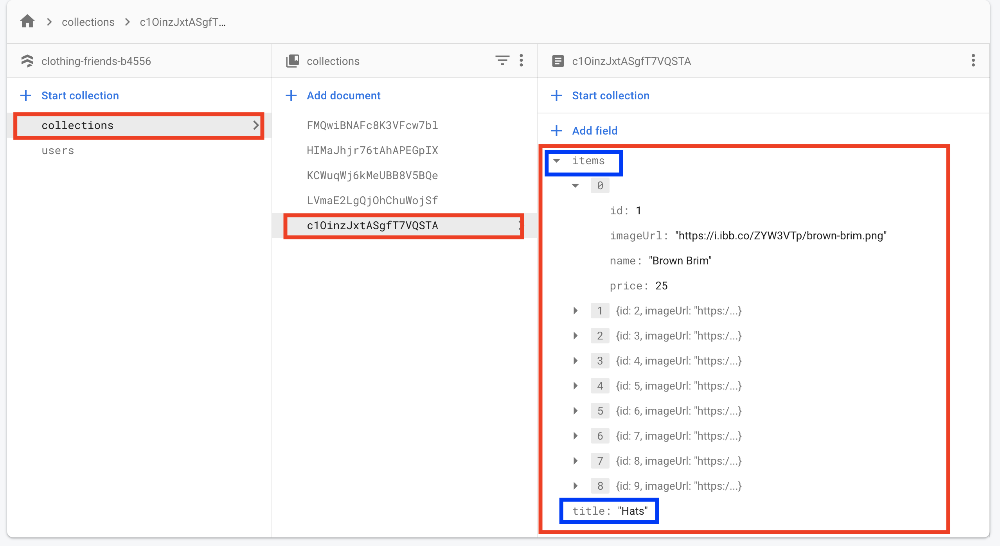
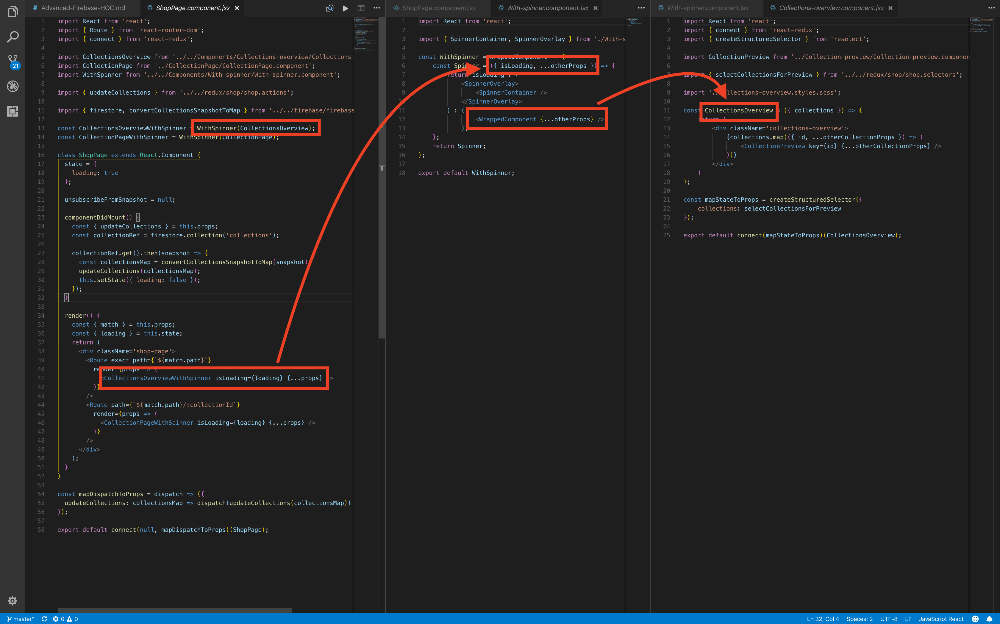
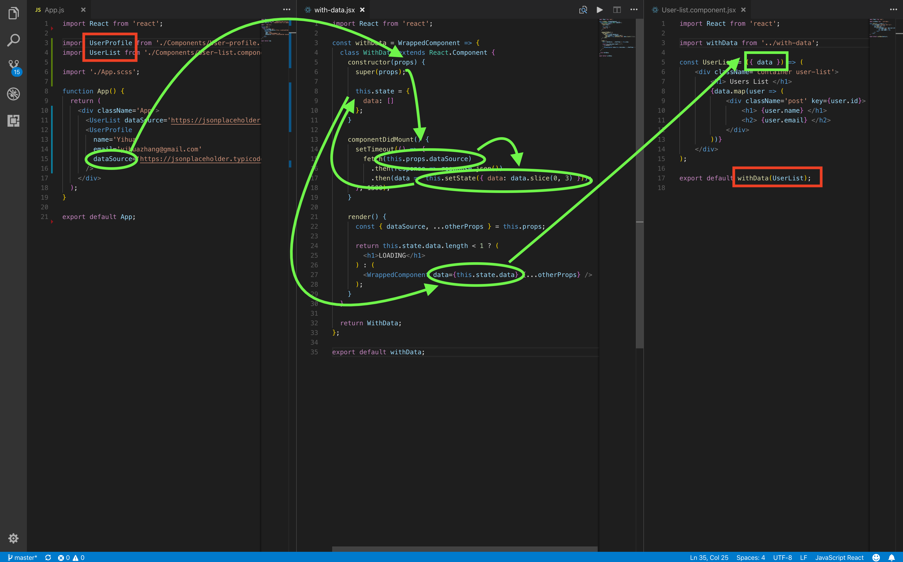

# Front end development tools (Part 5)

### `Key Words: Firebase security, security rules, Upload batch data to Firestore, Fetch data from Firestore, Spinner, Higher Order Component data flow, firestore batch & collection query.`

- #### Click here: [BACK TO NAVIGASTION](https://github.com/DonghaoWu/Frontend-tools-demo/blob/master/README.md)

## `Section: Advanced Firebase and higher order component.` (Advanced)

### `Summary`: In this documentation, we learn to set firestore security data flow and higher order component.

### `Check Dependencies & Tools:`

- styled-components
------------------------------------------------------------

#### `本章背景：`
1. Firestore security rules.
2. Firestore 的数据上传与获取。
3. Higher order component. (Spinner)

------------------------------------------------------------

### <span id="5.0">`Brief Contents & codes position`</span>

- #### Click here: [BACK TO NAVIGASTION](https://github.com/DonghaoWu/Frontend-tools-demo/blob/master/README.md)

- [5.1 Set up Firestore security rules.](#5.1)
- [5.2 Upload the shop data to Firestore.](#5.2)
- [5.3 Fetch the shop data from Firestore.](#5.3)
- [5.4 Delete local data and some code.](#5.4)
- [5.5 Add spinner in HOC pattern.](#5.5)

------------------------------------------------------------

### <span id="5.1">`Step1: Set up Firestore security rules.`</span>

- #### Click here: [BACK TO CONTENT](#5.0)

1. Set up here:

  <p align="center">
  
  </p>

  -----------------------------------------------------------------

2. Block all request:

```js
rules_version = '2';
service cloud.firestore {
  match /databases/{database}/documents {
    match /{document=**} {
      allow read, write: if false;
    }
  }
}
```

3. No security:

```js
rules_version = '2';
service cloud.firestore {
  match /databases/{database}/documents {
    match /{document=**} {
      allow read, write: if true;
    }
  }
}
```

4. Best practice:

```js
rules_version = '2';
service cloud.firestore {
  match /databases/{database}/documents {
    match /users/{userId} {
        allow get, write: if request.auth != null && request.auth.uid == userId;
    }
    match /collections/{collectionId} {
        allow read;
        allow write: if request.auth != null && request.auth.uid == 'Your admin user uid here'
    }
  }
}
```

#### `Comment:`
1. Challenge: set up cart security rules.

### <span id="5.2">`Step2: Upload the shop data to Firestore.`</span>

- #### Click here: [BACK TO CONTENT](#5.0)

1. Set up a function.

    __`Location:./clothing-friends-firebase-hoc/client/src/firebase/firebase.utils.js`__

    ```js
    const createCollectionAndDocsInFirestore = async (collectionKeyToCreate, objectsToAdd) => {
        const collectionRef = firestore.collection(collectionKeyToCreate);
        const batch = firestore.batch();

        objectsToAdd.forEach(obj => {
            const newDocRef = collectionRef.doc();
            batch.set(newDocRef, obj);
        });

        return await batch.commit();
    }
    ```

2. Upload the data to Firestore.

    Option 1: Run the function in App.js componentDidMount part one time.
    - check here: `./note/uploadData/App-upload-data.js`

    Option 2: Run the seed file. `(without set up any firebase security rules)`

    - check here: `./clothing-friends-firebase-hoc/client/src/firebase/seed.js`
    - command:
    ```bash
    $ node seed.js
    ```

3. :gem::gem::gem: Data flow:

- Data: `origin` ----> `<Object>`
```diff
const SHOP_DATA = {
+    hats: {
+        id: 1,
+        title: 'Hats',
+        routeName: 'hats',
+        items: [
+            {
+                id: 1,
+                name: 'Brown Brim',
+                imageUrl: 'https://i.ibb.co/ZYW3VTp/brown-brim.png',
+                price: 25
+            }
+        ]
+    },
    sneakers: {
        id: 2,
        title: 'Sneakers',
        routeName: 'sneakers',
        items: [
            {
                id: 10,
                name: 'Adidas NMD',
                imageUrl: 'https://i.ibb.co/0s3pdnc/adidas-nmd.png',
                price: 220
            }
        ]
    }
}
```

- Code: `shop.selectors.js`
```js
export const selectCollections = createSelector(
    [selectShop],
    shop => shop.collections
);

export const selectCollectionsForPreview = createSelector(
    [selectCollections],
    collections => Object.keys(collections).map(key => collections[key])
);
```

- Data: `selectCollectionsForPreview` ----> `<Array>`
```diff
const selectCollectionsForPreview = [
+    {
+        id: 1,
+        title: 'Hats',
+        routeName: 'hats',
+        items: [
+            {
+                id: 1,
+                name: 'Brown Brim',
+                imageUrl: 'https://i.ibb.co/ZYW3VTp/brown-brim.png',
+                price: 25
+            }
+        ]
+    },
    {
        id: 2,
        title: 'Sneakers',
        routeName: 'sneakers',
        items: [
            {
                id: 10,
                name: 'Adidas NMD',
                imageUrl: 'https://i.ibb.co/0s3pdnc/adidas-nmd.png',
                price: 220
            }
        ]
    }
]
```

- :gem::gem::gem: Code: `firebase.utils.js`
```js
const createCollectionAndDocsInFirestore = async (collectionKeyToCreate, objectsToAdd) => {
  const collectionRef = firestore.collection(collectionKeyToCreate);
  const batch = firestore.batch();

  objectsToAdd.forEach(obj => {
    const newDocRef = collectionRef.doc();
    batch.set(newDocRef, obj);
  });

  return await batch.commit();
}
```

- Code: `App.js`
```js
const targetDataArr = collectionsArr.map(category => {
    return {
        title: category.title,
        items: category.items
    }
})
createCollectionAndDocsInFirestore('collections', targetDataArr);
```

- Data: `targetDataArr / objectsToAdd` ----> `<Array>`
```diff
const objectsToAdd = [
+    {
+        title: 'Hats',
+        items: [
+            {
+                id: 1,
+                name: 'Brown Brim',
+                imageUrl: 'https://i.ibb.co/ZYW3VTp/brown-brim.png',
+                price: 25
+            }
+        ]
+    },
    {
        title: 'Sneakers',
        items: [
            {
                id: 10,
                name: 'Adidas NMD',
                imageUrl: 'https://i.ibb.co/0s3pdnc/adidas-nmd.png',
                price: 220
            }
        ]
    }
]
```

- Data: `obj` ----> `<object>`
```js
const obj = {
    title: 'Hats',
    items: [
        {
            id: 1,
            name: 'Brown Brim',
            imageUrl: 'https://i.ibb.co/ZYW3VTp/brown-brim.png',
            price: 25
        }
    ]
}
```

- Data store in firestore.

  <p align="center">
  
  </p>

  -----------------------------------------------------------------

#### `Comment:`
1. Data types: object -> array -> array.


### <span id="5.3">`Step3: Fetch the shop data from Firestore.`</span>

- #### Click here: [BACK TO CONTENT](#5.0)

1. Add redux shop types.

    __`Location:./clothing-friends-firebase-hoc/client/src/redux/shop/shop.types.js`__

    ```js
    export const UPDATE_COLLECTIONS = 'UPDATE_COLLECTIONS';
    ```

2. Add redux shop actions.

    __`Location:./clothing-friends-firebase-hoc/client/src/redux/shop/shop.actions.js`__

    ```js
    import { UPDATE_COLLECTIONS } from './shop.types';

    export const updateCollections = collectionsMap => ({
        type: UPDATE_COLLECTIONS,
        payload: collectionsMap
    });
    ```

3. Add redux shop reducer.

    __`Location:./clothing-friends-firebase-hoc/client/src/redux/shop/shop.reducer.js`__

    ```js
    import SHOP_DATA from './shop.data';
    import { UPDATE_COLLECTIONS } from './shop.types';

    const INITIAL_STATE = {
        collections: SHOP_DATA
    };

    const shopReducer = (state = INITIAL_STATE, action) => {
        switch (action.type) {
            case UPDATE_COLLECTIONS:
            return {
                ...state,
                collections: action.payload
            };
            default:
            return state;
        }
    };

    export default shopReducer;
    ```

4. :gem::gem::gem: Dispatch the action in ShopPage.component.jsx and convert the data.

    __`Location:./clothing-friends-firebase-hoc/client/src/firebase/firebase.utils.js`__

    ```js
    const convertCollectionsSnapshotToMap = collections => {
        const transformedCollection = collections.docs.map(doc => {
            const { title, items } = doc.data();

            return {
                routeName: encodeURI(title.toLowerCase()),
                id: doc.id,
                title,
                items
            };
        });

        return transformedCollection.reduce((accumulator, collection) => {
            accumulator[collection.title.toLowerCase()] = collection;
            return accumulator;
        }, {});

        /*
        let res = {};

        for(let i = 0; i < transformedCollection.length; i++){
            res[transformedCollection[i].title.toLowerCase()] = transformedCollection[i];
        }
        return res;
        */
    };
    ```

    - Data flow:

    - transformedCollection ---> `Array`
    ```js
    const transformedCollection = [
        {
            id: "c1OinzJxtASgfT7VQSTA",
            routeName: "hats",
            title: "Hats",
            items: [
                {
                    id: 1
                    imageUrl: "https://i.ibb.co/ZYW3VTp/brown-brim.png"
                    name: "Brown Brim"
                    price: 25
                }
            ]
        }   
    ]
    ```

    - res ---> `Object`
    ```js
    const res = {
        hats: {
            id: "c1OinzJxtASgfT7VQSTA",
            routeName: "hats",
            title: "Hats",
            items: [
                {
                    id: 1
                    imageUrl: "https://i.ibb.co/ZYW3VTp/brown-brim.png"
                    name: "Brown Brim"
                    price: 25
                }
            ]
        }
    }
    ```

    __`Location:./clothing-friends-firebase-hoc/client/src/Pages/ShopPage/ShopPage.js`__

    ```jsx
    import React from 'react';
    import { Route } from 'react-router-dom';
    import { connect } from 'react-redux';

    import CollectionsOverview from '../../Components/Collections-overview/Collections-overview.component';
    import CollectionPage from '../CollectionPage/CollectionPage.component';

    import { updateCollections } from '../../redux/shop/shop.actions';

    import { firestore, convertCollectionsSnapshotToMap } from '../../firebase/firebase.utils.js';

    class ShopPage extends React.Component {

        componentDidMount() {
            const { updateCollections } = this.props;
            const collectionRef = firestore.collection('collections');

            collectionRef.get().then(snapshot => {
                const collectionsMap = convertCollectionsSnapshotToMap(snapshot);
                updateCollections(collectionsMap);
                console.log('collections', collectionsMap)
            });
        }

        render() {
            const { match } = this.props;
            return (
                <div className='shop-page'>
                    <Route exact path={`${match.path}`} component={CollectionsOverview} />
                    <Route path={`${match.path}/:collectionId`} component={CollectionPage} />
                </div>
            )
        }
    }

    const mapDispatchToProps = dispatch => ({
        updateCollections: collectionsMap => dispatch(updateCollections(collectionsMap))
    });

    export default connect(null, mapDispatchToProps)(ShopPage);
    ```

#### `Comment:`
1. :gem: 从上一章开始，处理的 shop data 数据都是以 object 的形式出现，参看上面 res 的例子。

2. :gem: 相比 upload API，download API 更加常用。

3. 使用到的 firebase API:

```diff
+ const collections = firestore.collection(collectionKey);  <获得 collection 数据>
+ const snapShot = collections.docs; <获得 collection 数据并以 array 形式出现>
+ doc.data() <获得实际存储数据>
```

4. :gem: 到目前为止，ShopPage component 从 firestore 获得了 object data，而且把 data dispatch 回到 shop reducer，而 shop reducer 的原始数据还是本地 object data，接下来是删除本地 object data，并使用 spinner 过渡 fetch data 过程。

### <span id="5.4">`Step4: Delete local data and change some code.`</span>

- #### Click here: [BACK TO CONTENT](#5.0)

1. Delete local data.

    ```diff
    - ./clothing-friends-firebase-hoc/client/src/redux/shop/shop.data.js
    ```

2. Delete some code.

    __`Location:./clothing-friends-firebase-hoc/client/src/redux/shop/shop.reducer.js`__

```diff
- import SHOP_DATA from './shop.data';
import { UPDATE_COLLECTIONS } from './shop.types';

const INITIAL_STATE = {
-  collections: SHOP_DATA
+  collections: null
};

const shopReducer = (state = INITIAL_STATE, action) => {
  switch (action.type) {
    case UPDATE_COLLECTIONS:
      return {
        ...state,
        collections: action.payload
      };
    default:
      return state;
  }
};

export default shopReducer;
```

3. Add some code.

    __`Location:./clothing-friends-firebase-hoc/client/src/redux/shop/shop.selectors.js`__

```diff
import { createSelector } from 'reselect';

const selectShop = state => state.shop;

export const selectCollections = createSelector(
    [selectShop],
    shop => shop.collections
);

export const selectCollectionsForPreview = createSelector(
    [selectCollections],
    collections =>
+        collections ? Object.keys(collections).map(key => collections[key]) : []
);

export const selectCollection = collectionUrlParam => {
    return createSelector(
        [selectCollections],
+        collections => (collections ? collections[collectionUrlParam] : null)
    );
}
```

#### `Comment:`
1. 到这步为止， ColletionPage component 仍然会报错，主要是 `cannot read ... of null`。

### <span id="5.5">`Step5: Add spinner in HOC pattern.`</span>

- #### Click here: [BACK TO CONTENT](#5.0)

1. Install a dependency.

    ```bash
    $ cd client
    $ npm i styled-components
    ```

2. Create a HOC spinner component.

    __`Location:./clothing-friends-firebase-hoc/client/src/Components/With-spinner/With-spinner.component.jsx`__

    ```jsx
    import React from 'react';

    import { SpinnerContainer, SpinnerOverlay } from './With-spinner.styles';

    const WithSpinner = WrappedComponent => {
        const Spinner = ({ isLoading, ...otherProps }) => {
            return isLoading ? (
                <SpinnerOverlay>
                    <SpinnerContainer />
                </SpinnerOverlay>
            ) : (
                <WrappedComponent {...otherProps} />
            );
        };
        return Spinner;
    };

    export default WithSpinner;
    ```

    __`Location:./clothing-friends-firebase-hoc/client/src/Components/With-spinner/With-spinner.styles.scss`__

    ```jsx
    import styled from 'styled-components';

    export const SpinnerOverlay = styled.div`
        height: 60vh;
        width: 100%;
        display: flex;
        justify-content: center;
        align-items: center;
    `;

    export const SpinnerContainer = styled.div`
        display: inline-block;
        width: 50px;
        height: 50px;
        border: 3px solid rgba(195, 195, 195, 0.6);
        border-radius: 50%;
        border-top-color: #636767;
        animation: spin 1s ease-in-out infinite;
        -webkit-animation: spin 1s ease-in-out infinite;
        @keyframes spin {
            to {
            -webkit-transform: rotate(360deg);
            }
        }
        @-webkit-keyframes spin {
            to {
            -webkit-transform: rotate(360deg);
            }
        }
    `;
    ```

2. Apply the HOC in ShopPage component

    __`Location:./clothing-friends-firebase-hoc/client/src/Pages/ShopPage/ShopPage.component.jsx`__

    ```jsx
    import React from 'react';
    import { Route } from 'react-router-dom';
    import { connect } from 'react-redux';

    import CollectionsOverview from '../../Components/Collections-overview/Collections-overview.component';
    import CollectionPage from '../CollectionPage/CollectionPage.component';
    import WithSpinner from '../../Components/With-spinner/With-spinner.component';

    import { updateCollections } from '../../redux/shop/shop.actions';

    import { firestore, convertCollectionsSnapshotToMap } from '../../firebase/firebase.utils.js';

    const CollectionsOverviewWithSpinner = WithSpinner(CollectionsOverview);
    const CollectionPageWithSpinner = WithSpinner(CollectionPage);

    class ShopPage extends React.Component {
        state = {
            loading: true
        };

        componentDidMount() {
            const { updateCollections } = this.props;
            const collectionRef = firestore.collection('collections');

            collectionRef.get().then(snapshot => {
                const collectionsMap = convertCollectionsSnapshotToMap(snapshot);
                updateCollections(collectionsMap);
                this.setState({ loading: false });
            });
        }

        render() {
            const { match } = this.props;
            const { loading } = this.state;
            return (
                <div className='shop-page'>
                    <Route exact path={`${match.path}`}
                        render={ props => (<CollectionsOverviewWithSpinner isLoading={loading} {...props} />) }
                    />
                    <Route path={`${match.path}/:collectionId`}
                        render={ props => (<CollectionPageWithSpinner isLoading={loading} {...props} />) }
                    />
                </div>
            );
        }
    }

    const mapDispatchToProps = dispatch => ({
        updateCollections: collectionsMap => dispatch(updateCollectio(collectionsMap))
    });

    export default connect(null, mapDispatchToProps)(ShopPage);
    ```

#### `Comment:`
1. :gem::gem::gem: HOC 传递参数方法：
```jsx
<Route exact path={`${match.path}`} 
    render={ props => (<CollectionsOverviewWithSpinner isLoading={loading} {...props} />) } 
/>
```

2. 以下这样写是会出现错误的，上面的写法是为了传递参数到 CollectionsOverviewWithSpinner component。
```diff
- <Route exact path={`${match.path}`} component={CollectionsOverviewWithSpinner isLoading={loading} }/>
```

3. HOC data flow:

  <p align="center">
  
  </p>

  -----------------------------------------------------------------

4. HOC 优点：1. 数据处理； 2. 通用性好，可重用；

- EXTRA: HOC

- 可以在 `./note/hoc-example` 查看详细代码：

- hoc-example data flow:

<p align="center">

</p>

-----------------------------------------------------------------

- :gem::gem::gem: 要注意上面两张图对 HOC 传递的参数方法不相同。

__`本章用到的全部资料：`__

- null

- #### Click here: [BACK TO CONTENT](#5.0)
- #### Click here: [BACK TO NAVIGASTION](https://github.com/DonghaoWu/Frontend-tools-demo/blob/master/README.md)