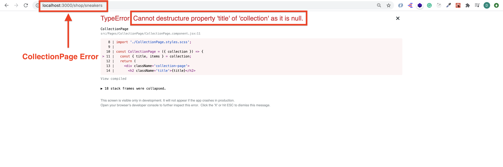

# Front end development tools (Part 5)

### `Key Word: Firebase security, security rules, Upload batch data to Firestore, Fetch data from Firestore, Spinner, Higher Order Component.`

- #### Click here: [BACK TO NAVIGASTION](https://github.com/DonghaoWu/Frontend-tools-demo/blob/master/README.md)

## `Section: Advanced Firebase and higher order component.` (Basic)

### `Summary`: In this documentation, we learn to set firestore security data flow and higher order component.

### `Check Dependencies & Tools:`

- 
------------------------------------------------------------

#### `本章背景：`
1. Firestore security rules.
2. Firestore 的数据上传与获取。
3. higher order component. (Spinner)

------------------------------------------------------------

### <span id="5.0">`Brief Contents & codes position`</span>

- #### Click here: [BACK TO NAVIGASTION](https://github.com/DonghaoWu/Frontend-tools-demo/blob/master/README.md)

- [5.1 Set up Firestore security rules.](#5.1)
- [5.2 Upload the shop data to Firestore.](#5.2)
- [5.3 Fetch the shop data from Firestore.](#5.3)
- [5.4 Set up other files.](#5.4)
- [5.5 Deploy on Heroku.](#5.5)

------------------------------------------------------------

### <span id="5.1">`Step1: Set up Firestore security rules.`</span>

- #### Click here: [BACK TO CONTENT](#5.0)

1. Set up here:

  <p align="center">
  
  </p>

  -----------------------------------------------------------------

2. Block all request:

```js
rules_version = '2';
service cloud.firestore {
  match /databases/{database}/documents {
    match /{document=**} {
      allow read, write: if false;
    }
  }
}
```

3. No security:

```js
rules_version = '2';
service cloud.firestore {
  match /databases/{database}/documents {
    match /{document=**} {
      allow read, write: if true;
    }
  }
}
```

4. Best practice:

```js
rules_version = '2';
service cloud.firestore {
  match /databases/{database}/documents {
    match /users/{userId} {
        allow get, write: if request.auth != null && request.auth.uid == userId;
    }
    match /collections/{collectionId} {
        allow read;
        allow write: if request.auth != null && request.auth.uid == 'sw9C9veKXFdC4PNjaXwFeLgmr8k2'
    }
  }
}
```

#### `Comment:`
1. Challenge: set up cart security rules.


### <span id="5.2">`Step2: Upload the shop data to Firestore.`</span>

- #### Click here: [BACK TO CONTENT](#5.0)

1. Set up a function.

    __`Location:./clothing-friends-firebase-hoc/client/src/firebase/firebase.utils.js`__

    ```js
    const createCollectionAndDocsInFirestore = async (collectionKeyToCreate, objectsToAdd) => {
    const collectionRef = firestore.collection(collectionKeyToCreate);
    const batch = firestore.batch();

    objectsToAdd.forEach(obj => {
        const newDocRef = collectionRef.doc();
        batch.set(newDocRef, obj);
    });

    return await batch.commit();
    }
    ```

2. Upload the data to Firestore.

    Option 1: Run the function in App.js componentDidMount part one time.
    - check here: `./note/uploadData/App-up-load-data.js`

    Option 2: Run the seed file.
    - check here: `./clothing-friends-firebase-hoc/client/src/firebase/seed.js`
    - command:
    ```bash
    $ node seed.js
    ```

3. :gem::gem::gem: Data flow:

    - Original data:
    ```json

    ```


#### `Comment:`
1. 

### <span id="5.3">`Step3: Fetch the shop data from Firestore.`</span>

- #### Click here: [BACK TO CONTENT](#5.0)


#### `Comment:`
1. 


### <span id="5.4">`Step4: Set up other files.`</span>

- #### Click here: [BACK TO CONTENT](#5.0)

1. Replace with new favicon.

    __`Location:./clothing-friends-stripe-deployED1/public/favicon.ico`__

2. Change App index.html title tag.

    __`Location:./clothing-friends-stripe-deployED1/public/index.html`__

3. Remove redux-logger in production mode.

    __`Location:./clothing-friends-stripe-deployED1/src/redux/store.js`__

    ```js
    import { createStore, applyMiddleware } from 'redux';
    import { persistStore } from 'redux-persist';
    import logger from 'redux-logger';

    import rootReducer from './root-reducer';

    const middlewares = [];

    if (process.env.NODE_ENV === 'development') {
        middlewares.push(logger);
    }

    export const store = createStore(rootReducer, applyMiddleware(...middlewares));

    export const persistor = persistStore(store);

    export default { store, persistStore };
    ```

#### `Comment:`
1. 

### <span id="5.5">`Step5: Deploy on Heroku.`</span>

- #### Click here: [BACK TO CONTENT](#5.0)

1. Deploy on Heroku - `<In app root directory>`:

    ```bash
    $ git init
    $ heroku login
    $ heroku create <your app name>
    $ heroku git:remote -a <your app name>
    $ git add .
    $ git commit -m'something'
    $ git push heroku master --force
    ```

2. Add stripe secret key in Heroku.

  <p align="center">
  
  </p>

  -----------------------------------------------------------------

3. Add firebase Authorized domain.

  <p align="center">
  
  </p>

  -----------------------------------------------------------------

5. Unhide firebase publish api key.

#### `Comment:`
1. Other commands:
    ```diff
    + $ heroku apps
    + $ git remote
    ```

------------------------------------------------------------

__`本章用到的全部资料：`__

- null

- #### Click here: [BACK TO CONTENT](#5.0)
- #### Click here: [BACK TO NAVIGASTION](https://github.com/DonghaoWu/Frontend-tools-demo/blob/master/README.md)