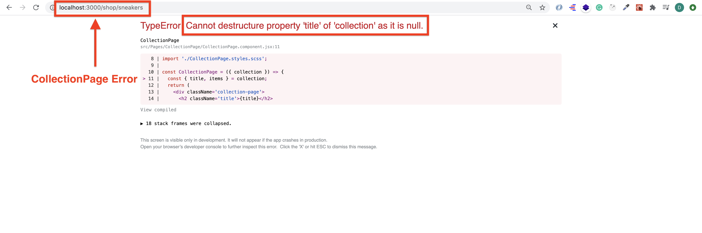

# Front end development tools (Part 6)

### `Key Word: redux-thunk, container pattern, throw error, solution for null bug.`

- #### Click here: [BACK TO NAVIGASTION](https://github.com/DonghaoWu/Frontend-tools-demo/blob/master/README.md)

## `Section: Redux-thunk and container pattern.` (Advanced)

### `Summary`: In this documentation, we learn to set redux-thunk and container pattern.

### `Check Dependencies & Tools:`

- redux-thunk
------------------------------------------------------------

#### `本章背景：`
1. 应用 redux-thunk。
2. 修正一个常见的 fetch data error。
3. 应用 container pattern。

------------------------------------------------------------

### <span id="6.0">`Brief Contents & codes position`</span>

- #### Click here: [BACK TO NAVIGASTION](https://github.com/DonghaoWu/Frontend-tools-demo/blob/master/README.md)

- [6.1 Add redux-thunk to the application.](#6.1)
- [6.2 Fix a fetching data error.](#6.2)
- [6.3 Container pattern.](#6.3)

------------------------------------------------------------

### <span id="6.1">`Step1: Add redux-thunk to the application.`</span>

- #### Click here: [BACK TO CONTENT](#6.0)

1. Install dependency:

    ```bash
    $ cd client
    $ npm i redux-thunk
    ```

2. Add new types.
    __`Location:./clothing-friends-thunk-container/client/src/redux/shop/shop.types.js`__

    ```js
    export const FETCH_COLLECTIONS_START = 'FETCH_COLLECTIONS_START';
    export const FETCH_COLLECTIONS_SUCCESS = 'FETCH_COLLECTIONS_SUCCESS';
    export const FETCH_COLLECTIONS_FAILURE = 'FETCH_COLLECTIONS_FAILURE';
    ```

3. :gem::gem::gem:Add new actions.
    __`Location:./clothing-friends-thunk-container/client/src/redux/shop/shop.actions.js`__

    ```js
    import { FETCH_COLLECTIONS_START, FETCH_COLLECTIONS_SUCCESS, FETCH_COLLECTIONS_FAILURE } from './shop.types';
    import { firestore, convertCollectionsSnapshotToMap } from '../../firebase/firebase.utils';

    export const fetchCollectionsStart = () => ({
        type: FETCH_COLLECTIONS_START
    });

    export const fetchCollectionsSuccess = collectionsMap => ({
        type: FETCH_COLLECTIONS_SUCCESS,
        payload: collectionsMap
    });

    export const fetchCollectionsFailure = (errorMessage) => ({
        type: FETCH_COLLECTIONS_FAILURE,
        payload: errorMessage
    });

    export const fetchCollectionAsync = () => dispatch => {
        const collectionRef = firestore.collection('collections');
        dispatch(fetchCollectionsStart());

        collectionRef.get()
            .then(snapshot => {
                /*if (true) throw new Error('This is a testing message.');*/
                const collectionsMap = convertCollectionsSnapshotToMap(snapshot);
                dispatch(fetchCollectionsSuccess(collectionsMap));
            })
            .catch(error => dispatch(fetchCollectionsFailure(error.message)));
    }
    ```

4. Add reducer case.
    __`Location:./clothing-friends-thunk-container/client/src/redux/shop/shop.reducer.js`__

    ```js
    import { FETCH_COLLECTIONS_START, FETCH_COLLECTIONS_SUCCESS, FETCH_COLLECTIONS_FAILURE } from './shop.types';

    const INITIAL_STATE = {
        collections: null,
        isFetching: false,
        errorMessage: undefined
    };

    const shopReducer = (state = INITIAL_STATE, action) => {
        switch (action.type) {
            case FETCH_COLLECTIONS_START:
            return {
                ...state,
                isFetching: true
            };
            case FETCH_COLLECTIONS_SUCCESS:
            return {
                ...state,
                isFetching: false,
                collections: action.payload
            };
            case FETCH_COLLECTIONS_FAILURE:
            return {
                ...state,
                isFetching: false,
                errorMessage: action.payload
            };
            default:
            return state;
        }
    };

    export default shopReducer;
    ```

5. Add new selectors:
    __`Location:./clothing-friends-thunk-container/client/src/redux/shop/shop.selectors.js`__

    ```js
    import { createSelector } from 'reselect';

    const selectShop = state => state.shop;

    export const selectCollections = createSelector(
        [selectShop],
        shop => shop.collections
    );

    export const selectCollectionsForPreview = createSelector(
        [selectCollections],
        collections =>
            collections ? Object.keys(collections).map(key => collections[key]) : []
    );

    export const selectCollection = collectionUrlParam => {
        return createSelector(
            [selectCollections],
            collections => (collections ? collections[collectionUrlParam] : null)
        );
    }

    export const selectIsCollectionFetching = createSelector(
        [selectShop],
        shop => shop.isFetching
    );
    ```

6. ShopPage:
    __`Location:./clothing-friends-thunk-container/client/src/Pages/ShopPage/ShopPage.component.jsx`__

    ```jsx
    import React from 'react';
    import { Route } from 'react-router-dom';
    import { connect } from 'react-redux';
    import { createStructuredSelector } from 'reselect';

    import CollectionsOverview from '../../Components/Collections-overview/Collections-overview.component';
    import CollectionPage from '../CollectionPage/CollectionPage.component';
    import WithSpinner from '../../Components/With-spinner/With-spinner.component';

    import { fetchCollectionAsync } from '../../redux/shop/shop.actions';
    import { selectIsCollectionFetching } from '../../redux/shop/shop.selectors';

    const CollectionsOverviewWithSpinner = WithSpinner(CollectionsOverview);
    const CollectionPageWithSpinner = WithSpinner(CollectionPage);

    class ShopPage extends React.Component {

        componentDidMount() {
            this.props.fetchCollectionAsync();
        }

        render() {
            const { match, isCollectionFetching } = this.props;
            return (
                <div className='shop-page'>
                    <Route exact path={`${match.path}`}
                    render={props => (
                        <CollectionsOverviewWithSpinner isLoading={isCollectionFetching} {...props} />
                    )}
                    />
                    <Route path={`${match.path}/:collectionId`}
                    render={props => (
                        <CollectionPageWithSpinner isLoading={isCollectionFetching} {...props} />
                    )}
                    />
                </div>
            );
        }
    }

    const mapStateToProps = createStructuredSelector({
        isCollectionFetching: selectIsCollectionFetching
    });

    const mapDispatchToProps = dispatch => ({
        fetchCollectionAsync: () => dispatch(fetchCollectionAsync()),
    });

    export default connect(mapStateToProps, mapDispatchToProps)(ShopPage);
    ```

#### `Comment:`
1. 

### <span id="6.2">`Step2: Fix a fetching data error.`</span>

- #### Click here: [BACK TO CONTENT](#6.0)

1. Error happens when go to CollectionPage.

  <p align="center">
  
  </p>

  -----------------------------------------------------------------

2. 为什么会发生错误，以下为代码运行次序。

    1. 访问 Collection Page / Collection Overview Page
    2. ShopPage componentDidMount => fetchCollectionAsync();
    3. 1. async way: fetch data from firebase
       2. sync way: pass `isCollectionFetching` to two components: `CollectionsOverviewWithSpinner` & `CollectionPageWithSpinner`

    4. 必须指出 sync way 的执行比 async way 的执行要快，在 async way 获得 data 之前，两个 component 已经接到了原始 state 数据，分别是：
        - `CollectionsOverviewWithSpinner`: { isLoading: false }, 对应的 `CollectionsOverview`: { collections: [] }
        - `CollectionPageWithSpinner`: { isLoading: false }, 对应的 `CollectionPage`: { collections: {} }

    5. 而 `CollectionPage.component.jsx` 中有一句 sync 语句：
        ```jsx
        const { title, items } = collection;
        ```
    6. :gem::gem::gem: 这一句导致了 app 崩溃，同时也停止了所有动作，包括还没有完成的 async way。

    7. 而 `CollectionsOverview` 不报错的原因，可以看代码：

    ```jsx
    const CollectionsOverview = ({ collections }) => {
        return (
            <div className='collections-overview'>
                {collections.map(({ id, ...otherCollectionProps }) => (
                    <CollectionPreview key={id} {...otherCollectionProps} />
                ))}
            </div>
        )
    };
    ```

    8. 对一个 `[]`  执行 map 动作不会报错。

3. :gem::gem::gem:解决方案，在没有接收到 data 之前不对 CollectionsOverview 和 CollectionPage 执行 render 动作，也就不会从 reducer 获得任何数据。当数据获取成功，reducer 对 state 进行了修改，同时执行 render 动作，CollectionsOverview 和 CollectionPage 开始呈现，且使用有效数据，其中一个方案如下：


    __`Location:./clothing-friends-thunk-container/client/src/redux/shop/shop.reducer.js`__

    ```diff
    import { FETCH_COLLECTIONS_START, FETCH_COLLECTIONS_SUCCESS, FETCH_COLLECTIONS_FAILURE } from './shop.types';

    const INITIAL_STATE = {
        collections: null,
    -   isFetching: false,
    +   isFetching: true,
        errorMessage: undefined
    };

    const shopReducer = (state = INITIAL_STATE, action) => {
        switch (action.type) {
            case FETCH_COLLECTIONS_START:
                return {
                    ...state,
                    isFetching: true
                };
            case FETCH_COLLECTIONS_SUCCESS:
                return {
                    ...state,
                    isFetching: false,
                    collections: action.payload
                };
            case FETCH_COLLECTIONS_FAILURE:
                return {
                    ...state,
    -               isFetching: false,
    +               isFetching: true,
                    errorMessage: action.payload
                };
            default:
            return state;
        }
    };

    export default shopReducer;
    ```

#### `Comment:`
1. :gem::gem::gem: 这个错误很常见，在 front end 进行 async 动作时需要处理数据原始状态的问题。

### <span id="6.3">`Step3: Container pattern.`</span>

- #### Click here: [BACK TO CONTENT](#6.0)

1. 

#### `Comment:`
1. 

-----------------------------------------------------------------

__`本章用到的全部资料：`__

- null

- #### Click here: [BACK TO CONTENT](#6.0)
- #### Click here: [BACK TO NAVIGASTION](https://github.com/DonghaoWu/Frontend-tools-demo/blob/master/README.md)