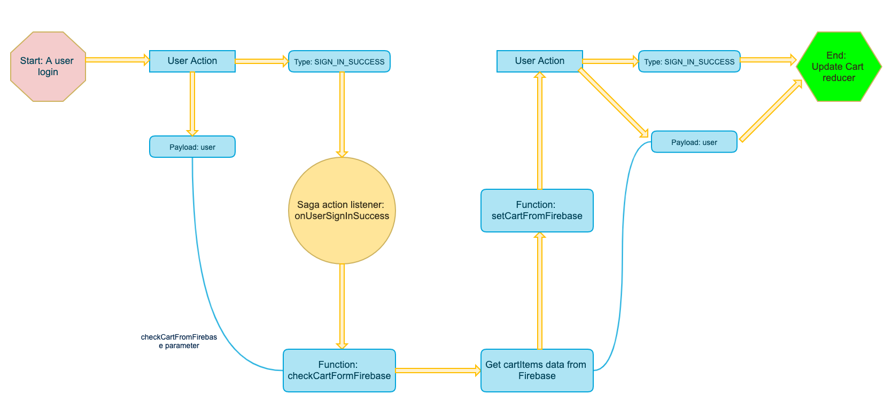
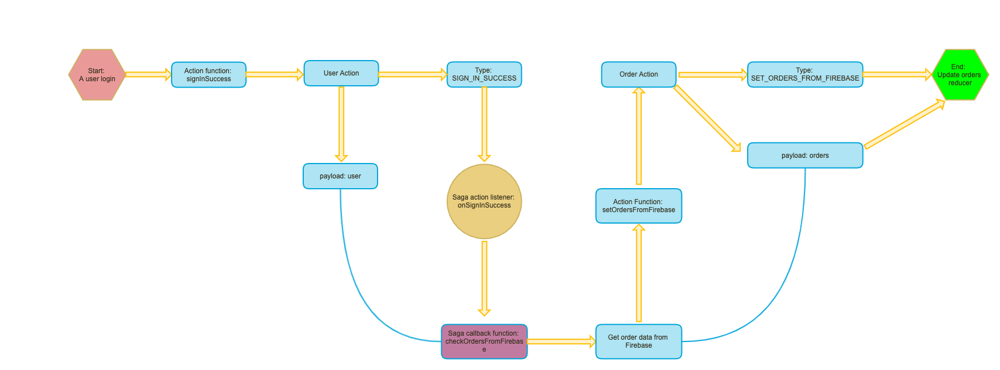
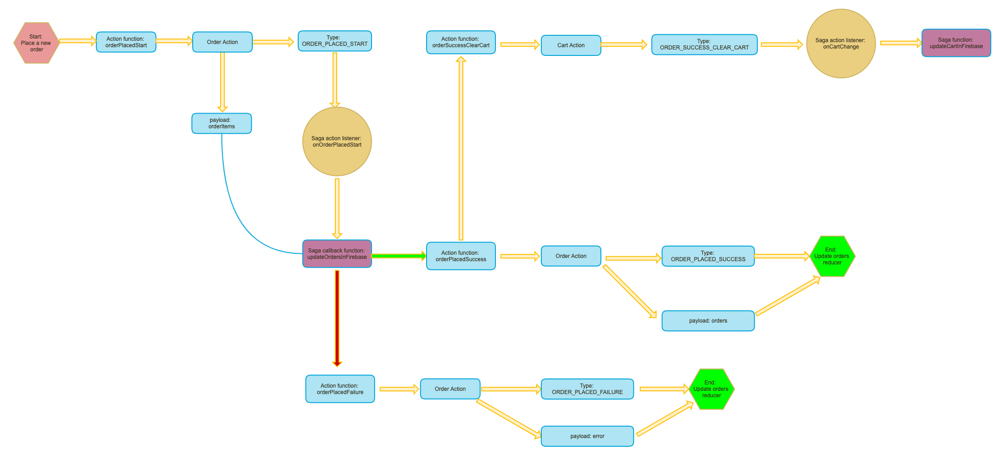
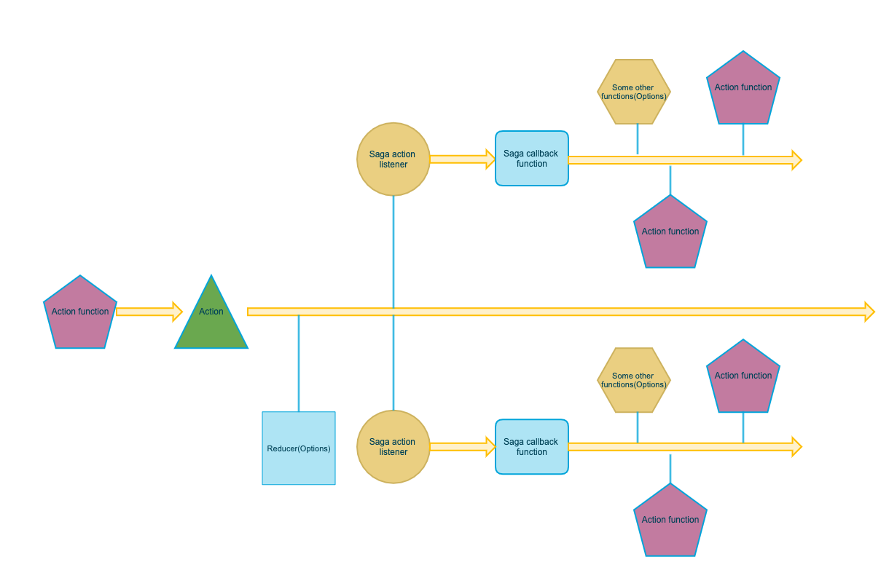

# Front end development tools (Part 14)

### `Key Words: Redux-saga, store user cart data and orders data in Firestore, Firestore data rules, notifications.`

- #### Click here: [BACK TO NAVIGASTION](https://github.com/DonghaoWu/Frontend-tools-demo/blob/master/README.md)

## `Section: Firebase, Cart Orders Notifications sagas.` (Advanced)

### `Summary`: In this documentation, we learn to store user cart data and orders data in Firestore, also learn related Firestore data rules.

### `Check Dependencies & Tools:`

- redux-saga
------------------------------------------------------------

#### `本章背景：`
1. 配置 redux-saga。
2. 熟悉 redux-saga 的设置流程。
3. [Part 7: Redux-saga & configuration.](https://github.com/DonghaoWu/Frontend-tools-demo/blob/master/Redux-saga/Reudx-saga.md)
4. 其中 cart feature 新添加的功能都是在 saga 的循环里面完成的，不需要在 component 中触发。

------------------------------------------------------------

#### `Redux-saga API`
```diff

```

### <span id="14.0">`Brief Contents & codes position`</span>

- #### Click here: [BACK TO NAVIGASTION](https://github.com/DonghaoWu/Frontend-tools-demo/blob/master/README.md)

- [14.1 Firebase Cart.](#14.1)
- [14.2 Firebase Orders.](#14.2)
- [14.3 Firebase Notifications.](#14.3)

------------------------------------------------------------


### <span id="14.1">`Step1: Firebase Cart.`</span>

- #### Click here: [BACK TO CONTENT](#14.0)

1. Set up types.

    __`Location:./client/src/redux/cart/cart.types.js`__

    ```js
    export const SET_CART_FROM_FIREBASE = 'SET_CART_FROM_FIREBASE';
    ```

2. Set up actions.

    __`Location:./client/src/redux/cart/cart.actions.js`__

    ```js
    export const setCartFromFirebase = cartItems => ({
        type: SET_CART_FROM_FIREBASE,
        payload: cartItems
    });
    ```

    __`Location:./client/src/redux/user/user.actions.js`__

    ```js
    export const signInSuccess = user => ({
        type: SIGN_IN_SUCCESS,
        payload: user
    });
    ```

3. Set up a new firebase function to __`fetch/create`__ cart data in Firestore.

    __`Location:./client/src/firebase/firebase.utils.js`__

    ```js
    export const getUserCartRef = async userId => {
        const cartsRef = firestore.collection('carts').where('userId', '==', userId);
        const snapShot = await cartsRef.get();

        if (snapShot.empty) {
            const cartDocRef = firestore.collection('carts').doc();
            await cartDocRef.set({ userId, cartItems: [] });
            return cartDocRef;
        } else {
            return snapShot.docs[0].ref;
        }
    };
    ```

4. Set up sagas.

    __`Location:./client/src/redux/cart/cart.sagas.js`__

    ```js
    import { getUserCartRef } from '../../firebase/firebase.utils';

    import { SIGN_IN_SUCCESS } from '../user/user.types';
    import { ADD_ITEM, REMOVE_ITEM, CLEAR_ITEM_FROM_CART } from './cart.types';

    import { setCartFromFirebase } from './cart.actions';

    import { selectCurrentUser } from '../user/user.selectors';
    import { selectCartItems } from './cart.selectors';

    export function* checkCartFromFirebase({ payload: user }) {
        const cartRef = yield getUserCartRef(user.id);
        const cartSnapshot = yield cartRef.get();
        yield put(setCartFromFirebase(cartSnapshot.data().cartItems));
    };

    export function* onUserSignInSuccess() {
        yield takeLatest(SIGN_IN_SUCCESS, checkCartFromFirebase);
    };

    export function* updateCartInFirebase() {
        const currentUser = yield select(selectCurrentUser);
        if (currentUser) {
            try {
                const cartRef = yield getUserCartRef(currentUser.id);
                const cartItems = yield select(selectCartItems);
                yield cartRef.update({ cartItems });
            } catch (error) {
                console.log(error);
            }
        }
    };

    export function* onCartChange() {
        yield takeLatest(
            [
                ADD_ITEM,
                REMOVE_ITEM,
                CLEAR_ITEM_FROM_CART
            ],
            updateCartInFirebase
        );
    };

    export function* cartSagas() {
        yield all([call(onSignOutSuccess), call(onCartChange), call(onUserSignInSuccess)]);
    };
    ```

#### `Comment:`
1. 上面代码中跟 firebase 交流的代码：

```diff
+ const cartsRef = firestore.collection('carts').where('userId', '==', userId); // 获取

+ const cartDocRef = firestore.collection('carts').doc();
+ await cartDocRef.set({ userId, cartItems: [] }); // 新建

+ yield cartRef.update({ cartItems }); // 更新
```

2. 设计思路：

  <p align="center">
  
  </p>

  -----------------------------------------------------------------

### <span id="14.2">`Step2: Firebase Orders.`</span>

- #### Click here: [BACK TO CONTENT](#14.0)

1. Related component files and scss files.

    - ./client/src/Pages/OrdersPage/OrderPage.component.jsx
    - ./client/src/Pages/OrdersPage/OrderPage.styles.scss

    - ./client/src/Components/Order-overview/Order-overview.component.jsx
    - ./client/src/Components/Order-overview/Order-overview.styles.scss

    - ./client/src/Components/Order-preview/Order-preview.component.jsx
    - ./client/src/Components/Order-preview/Order-preview.styles.scss

    - ./client/src/Components/Order-item/Order-item.component.jsx
    - ./client/src/Components/Order-item/Order-item.styles.scss

    __`Location:./client/src/Components/Order-overview/Order-overview.component.jsx`__

    ```jsx
    import React from 'react';
    import { connect } from 'react-redux';
    import { createStructuredSelector } from 'reselect';

    import OrderPreview from '../Orders-preview/Order-preview.component';

    import { selectCurrentOrders } from '../../redux/orders/orders.selectors';

    import './Orders-overview.styles.scss';

    const OrdersOverview = ({ orders }) => {
        return (
            <div className='orders-overview'>
                <h1 className='orders-title'>Orders Overview</h1>
                {
                    orders.map(({ createdAt, orderItems }) => {
                        let time = createdAt.toDate ? createdAt.toDate().toString() : createdAt.toString();
                        return (
                            <OrderPreview
                                key={createdAt}
                                orderItems={orderItems}
                                time={time} />
                        )
                    })
                }
            </div>
        )
    };

    const mapStateToProps = createStructuredSelector({
        orders: selectCurrentOrders
    });

    export default connect(mapStateToProps)(OrdersOverview);
    ```

2. Set up types.

    __`Location:./client/src/redux/orders/orders.types.js`__

    ```js
    export const SET_ORDERS_FROM_FIREBASE = 'SET_ORDERS_FROM_FIREBASE';
    export const ORDER_PLACED_START = 'ORDER_PLACED_START';
    export const ORDER_PLACED_SUCCESS = 'ORDER_PLACED_SUCCESS';
    export const ORDER_PLACED_FAILURE = 'ORDER_PLACED_FAILURE';
    ```

    __`Location:./client/src/redux/cart/cart.types.js`__

    ```diff
    + export const ORDER_SUCCESS_CLEAR_CART = 'ORDER_SUCCESS_CLEAR_CART';
    ```

3. Set up actions.

    __`Location:./client/src/redux/orders/orders.actions.js`__

    ```js
    import {
        ORDER_PLACED_START,
        ORDER_PLACED_SUCCESS,
        ORDER_PLACED_FAILURE,
        SET_ORDERS_FROM_FIREBASE
    } from './orders.types';

    export const orderPlacedStart = (orderItems, history) => ({
        type: ORDER_PLACED_START,
        payload: orderItems,
        history: history
    });

    export const orderPlacedSuccess = orders => {
        return {
            type: ORDER_PLACED_SUCCESS,
            payload: orders
        }
    };

    export const orderPlacedFailure = (error) => {
        return {
            type: ORDER_PLACED_FAILURE,
            payload: error
        }
    };

    export const setOrdersFromFirebase = orders => {
        return {
            type: SET_ORDERS_FROM_FIREBASE,
            payload: orders
        }
    };
    ```

    __`Location:./client/src/redux/cart/cart.actions.js`__

    ```js

    import { ORDER_SUCCESS_CLEAR_CART } from './cart.types';

    export const orderSuccessClearCart = () => ({
        type: ORDER_SUCCESS_CLEAR_CART
    });
    ```

4. Set up reducer.

    __`Location:./client/src/redux/orders/orders.reducer.js`__

    ```jsx
    import { SET_ORDERS_FROM_FIREBASE, ORDER_PLACED_SUCCESS, ORDER_PLACED_FAILURE } from './orders.types';

    const INITIAL_STATE = {
        ordersList: [],
        error: null
    };

    const ordersReducer = (state = INITIAL_STATE, action) => {
        switch (action.type) {
            case SET_ORDERS_FROM_FIREBASE:
                return {
                    ...state,
                    ordersList: action.payload
                };
            case ORDER_PLACED_SUCCESS:
                return {
                    ...state,
                    ordersList: action.payload,
                    error: null
                };
            case ORDER_PLACED_FAILURE:
                return {
                    ...state,
                    error: action.payload
                }
            default:
                return state;
        }
    };

    export default ordersReducer;
    ```

    __`Location:./client/src/redux/root-reducer.js`__

    ```diff
    +   import ordersReducer from './orders/orders.reducer';

        const rootReducer = combineReducers({
            user: userReducer,
            cart: cartReducer,
            displayName: displayNameReducer,
            directory: directoryReducer,
            shop: shopReducer,
            hideCart: hideCartReducer,
    +       orders: ordersReducer,
        });
    ```

    __`Location:./client/src/redux/orders/orders.selectors.js`__

    ```js
    import { createSelector } from 'reselect';

    const selectOrders = state => state.orders;

    export const selectCurrentOrders = createSelector(
        [selectOrders],
        orders => orders.ordersList
    );
    ```

    __`Location:./client/src/redux/cart/cart.reducer.js`__

    ```diff
    + import { ORDER_SUCCESS_CLEAR_CART } from './cart.types';

    const cartReducer = (state = INITIAL_STATE, action) => {
        switch (action.type) {
            case CLEAR_CART:
    +       case ORDER_SUCCESS_CLEAR_CART:
                return {
                    ...state,
                    cartItems: []
                };
        }
    };
    ```

5. Set up sagas.

    __`Location:./client/src/redux/cart/cart.sagas.js`__

    ```js
    export function* onCartChange() {
        yield takeLatest(
            [
                ADD_ITEM,
                REMOVE_ITEM,
                CLEAR_ITEM_FROM_CART,
                ORDER_SUCCESS_CLEAR_CART
            ],
            updateCartInFirebase
        );
    };
    ```

    __`Location:./client/src/redux/orders/orders.sagas.js`__

    ```js
    import { all, call, takeLatest, put, select } from 'redux-saga/effects';

    import { getUserOrdersRef } from '../../firebase/firebase.utils';

    import { SIGN_IN_SUCCESS } from '../user/user.types';
    import { ORDER_PLACED_START } from '../orders/orders.types';

    import { setOrdersFromFirebase, orderPlacedSuccess, orderPlacedFailure } from './orders.actions';
    import { orderSuccessClearCart } from '../cart/cart.actions';

    import { selectCurrentUser } from '../user/user.selectors';
    import { selectCurrentOrders } from './orders.selectors';

    export function* checkOrdersFromFirebase({ payload: user }) {
        const ordersRef = yield getUserOrdersRef(user.id);
        const ordersSnapshot = yield ordersRef.get();
        yield put(setOrdersFromFirebase(ordersSnapshot.data().orders));
    };

    export function* onSignInSuccess() {
        yield takeLatest(SIGN_IN_SUCCESS, checkOrdersFromFirebase);
    };

    export function* updateOrdersInFirebase(action) {
        const orderItems = action.payload;
        const history = action.history
        const currentUser = yield select(selectCurrentUser);
        if (currentUser) {
            try {
                const ordersRef = yield getUserOrdersRef(currentUser.id);
                const orders = yield select(selectCurrentOrders);
                const newOrder = {
                    createdAt: new Date(),
                    orderItems
                };
                orders.unshift(newOrder);
                yield ordersRef.update({ orders });
                yield put(orderPlacedSuccess(orders));
                yield put(orderSuccessClearCart());
                history.push('/orders');
            } catch (error) {
                yield put(orderPlacedFailure(error));
                console.log(error);
            }
        }
    };

    export function* onOrderPlacedStart() {
        yield takeLatest(ORDER_PLACED_START, updateOrdersInFirebase);
    };

    export function* ordersSagas() {
        yield all([call(onSignInSuccess), call(onOrderPlacedStart)]);
    }
    ```

#### `Comment:`
1. Set orders from firebase when a user sign in.

  <p align="center">
  
  </p>

  -----------------------------------------------------------------

2. Order placed process.
  <p align="center">
  
  </p>

  -----------------------------------------------------------------

3. :gem::gem::gem:目前为止 redux-saga 最难的地方是跟踪 action，同时熟悉 saga callback function 是:gem:隐式:gem:获得参数的。


### <span id="14.2">`Step2: Firebase Notifications.`</span>

- #### Click here: [BACK TO CONTENT](#14.0)

1. Related component files and scss files.

    - ./client/src/App.js
    - ./client/src/App.styles.scss

    - ./client/src/Components/Notifications/Notifications.component.jsx
    - ./client/src/Components/Notifications/Notifications.styles.scss

    __`Location:./client/src/Components/Notifications/Notifications.component.jsx`__

    ```jsx
    import React from 'react'
    import { connect } from 'react-redux';
    import './Notification.styles.scss';
    import { createStructuredSelector } from 'reselect';
    import { selectCurrentNotices } from '../../redux/notices/notices.selectors';


    const Notification = (props) => props.notices !== null && props.notices.length > 0 && props.notices.map(notice => (
        <div key={notice.id} className={`notice notice-${notice.noticeType}`}>
            {notice.msg}
        </div>
    ));

    const mapStateToProps = createStructuredSelector({
        notices: selectCurrentNotices,
    });

    export default connect(mapStateToProps)(Notification);
    ```

2. Set up types.

    __`Location:./client/src/redux/notices/notices.types.js`__

    ```js
    export const SIGN_IN_SUCCESS_MSG = 'SIGN_IN_SUCCESS_MSG';
    export const SIGN_IN_FAILURE_MSG = 'SIGN_IN_FAILURE_MSG';
    export const SIGN_UP_SUCCESS_MSG = 'SIGN_UP_SUCCESS_MSG';
    export const SIGN_UP_FAILURE_MSG = 'SIGN_UP_FAILURE_MSG';
    export const SIGN_OUT_SUCCESS_MSG = 'SIGN_OUT_SUCCESS_MSG';
    export const SIGN_OUT_FAILURE_MSG = 'SIGN_OUT_FAILURE_MSG';

    export const ORDER_PLACED_SUCCESS_MSG = 'ORDER_PLACED_SUCCESS_MSG';
    export const ORDER_PLACED_FAILURE_MSG = 'ORDER_PLACED_FAILURE_MSG';

    export const ADD_NOTICE = 'ADD_NOTICE';
    export const REMOVE_NOTICE = 'REMOVE_NOTICE';
    ```

3. Set up actions.

    __`Location:./client/src/redux/notices/notices.actions.js`__

    ```js
    import {
        ADD_NOTICE,
        REMOVE_NOTICE
    } from './notices.types';

    export const addNotice = (msg, noticeType, id) => {
        return {
            type: ADD_NOTICE,
            payload: {
                msg: msg,
                noticeType: noticeType,
                id: id
            }
        }
    }

    export const removeNotice = (id) => {
        return {
            type: REMOVE_NOTICE,
            payload: id
        }
    };
    ```

4. Set up reducer.

    __`Location:./client/src/redux/notices/notices.reducer.js`__

    ```jsx
    import { ADD_NOTICE, REMOVE_NOTICE } from './notices.types';
    const initialState = [];

    export default function (state = initialState, action) {
        const { payload, type } = action;
        switch (type) {
            case ADD_NOTICE:
                return [...state, payload];
            case REMOVE_NOTICE:
                return state.filter(notice => notice.id !== payload);
            default:
                return state;
        }
    }
    ```

    __`Location:./client/src/redux/root-reducer.js`__

    ```diff
    +   import noticesReducer from './notices/notices.reducer';

        const rootReducer = combineReducers({
            user: userReducer,
            cart: cartReducer,
            displayName: displayNameReducer,
            directory: directoryReducer,
            shop: shopReducer,
            hideCart: hideCartReducer,
            orders: ordersReducer,
    +       notices: noticesReducer
        });
    ```

    __`Location:./client/src/redux/notices/notices.selectors.js`__

    ```js
    import { createSelector } from 'reselect';

    const selectNotices = state => state.notices;

    export const selectCurrentNotices = createSelector(
        [selectNotices],
        notices => notices
    );
    ```

5. Set up sagas.

    __`Location:./client/src/redux/notices/notices.sagas.js`__

    ```js
    import { takeLatest, put, all, call, delay, takeEvery } from 'redux-saga/effects';

    import {
        SIGN_IN_SUCCESS,
        SIGN_IN_FAILURE,
        SIGN_OUT_SUCCESS,
        SIGN_OUT_FAILURE,
        EMAIL_SIGN_UP_SUCCESS,
        EMAIL_SIGN_UP_FAILURE,
    } from '../user/user.types';

    import { ORDER_PLACED_SUCCESS, ORDER_PLACED_FAILURE } from '../orders/orders.types';

    import { v4 as uuid } from 'uuid'

    import { addNotice, removeNotice } from './notices.actions';

    import { setErrorMessage } from './notices.utils';

    export function* signInSuccessNotice() {
        const id = uuid();
        yield put(addNotice('Sign in success', 'success', id));
        yield delay(2500);
        yield put(removeNotice(id));
    }

    export function* onSignInSuccess() {
        yield takeLatest(SIGN_IN_SUCCESS, signInSuccessNotice);
    }

    export function* signInFailureNotice(action) {
        const id = uuid();
        yield put(addNotice(`Sign in failure:  ${setErrorMessage(action.payload.code)}`, 'danger', id));
        yield delay(2500);
        yield put(removeNotice(id));
    }

    export function* onSignInFailure() {
        yield takeEvery(SIGN_IN_FAILURE, signInFailureNotice);
    }

    export function* signOutSuccessNotice() {
        const id = uuid();
        yield put(addNotice('Sign out success', 'success', id));
        yield delay(2500);
        yield put(removeNotice(id));
    }

    export function* onSignOutSuccess() {
        yield takeLatest(SIGN_OUT_SUCCESS, signOutSuccessNotice);
    }

    export function* signOutFailureNotice(action) {
        const id = uuid();
        yield put(addNotice(`Sign out failure: ${setErrorMessage(action.payload.code)}`, id));
        yield delay(2500);
        yield put(removeNotice(id));
    }

    export function* onSignOutFailure() {
        yield takeLatest(SIGN_OUT_FAILURE, signOutFailureNotice);
    }

    export function* emailSignUpSuccessNotice() {
        const id = uuid();
        yield put(addNotice('Email sign up success', 'success', id));
        yield delay(2500);
        yield put(removeNotice(id));
    }

    export function* onEmailSignUpSuccess() {
        yield takeLatest(EMAIL_SIGN_UP_SUCCESS, emailSignUpSuccessNotice);
    }

    export function* emailSignUpFailureNotice(action) {
        const id = uuid();
        yield put(addNotice(`Email sign up failure: ${setErrorMessage(action.payload.code)}`, 'danger', id));
        yield delay(2500);
        yield put(removeNotice(id));
    }

    export function* onEmailSignUpFailure() {
        yield takeEvery(EMAIL_SIGN_UP_FAILURE, emailSignUpFailureNotice);
    }

    export function* orderPlacedSuccessNotice() {
        const id = uuid();
        yield put(addNotice('Order placed success', 'success', id));
        yield delay(2500);
        yield put(removeNotice(id));
    }

    export function* onOrderPlacedSuccess() {
        yield takeLatest(ORDER_PLACED_SUCCESS, orderPlacedSuccessNotice);
    }

    export function* orderPlacedFailureNotice(action) {
        const id = uuid();
        yield put(addNotice(`Order placed failure: ${setErrorMessage(action.payload.code)}`, 'danger', id));
        yield delay(2500);
        yield put(removeNotice(id));
    }

    export function* onOrderPlacedFailure() {
        yield takeLatest(ORDER_PLACED_FAILURE, orderPlacedFailureNotice);
    }

    export function* noticesSagas() {
        yield all([
            call(onSignInSuccess),
            call(onSignInFailure),
            call(onSignOutSuccess),
            call(onSignOutFailure),
            call(onOrderPlacedSuccess),
            call(onOrderPlacedFailure),
            call(onEmailSignUpSuccess),
            call(onEmailSignUpFailure)
        ]);
    }
    ```

#### `Comment:`
1. Redux-saga 运行流程：

  <p align="center">
  
  </p>

  -----------------------------------------------------------------

__`本章用到的全部资料：`__

- null

- #### Click here: [BACK TO CONTENT](#14.0)
- #### Click here: [BACK TO NAVIGASTION](https://github.com/DonghaoWu/Frontend-tools-demo/blob/master/README.md)