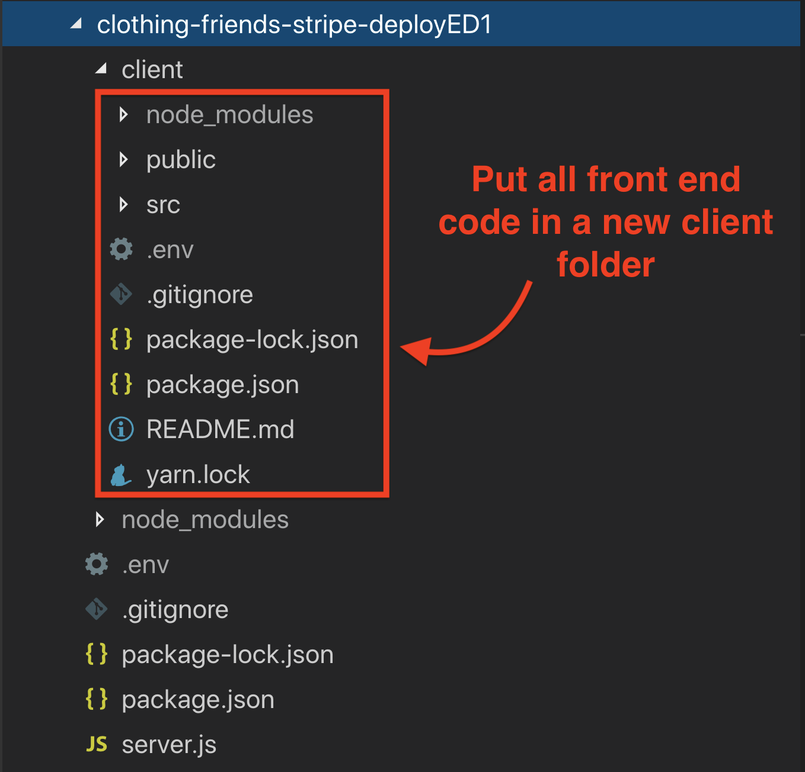
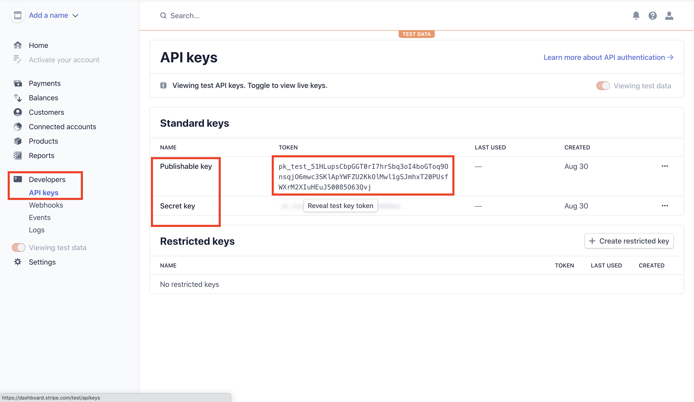
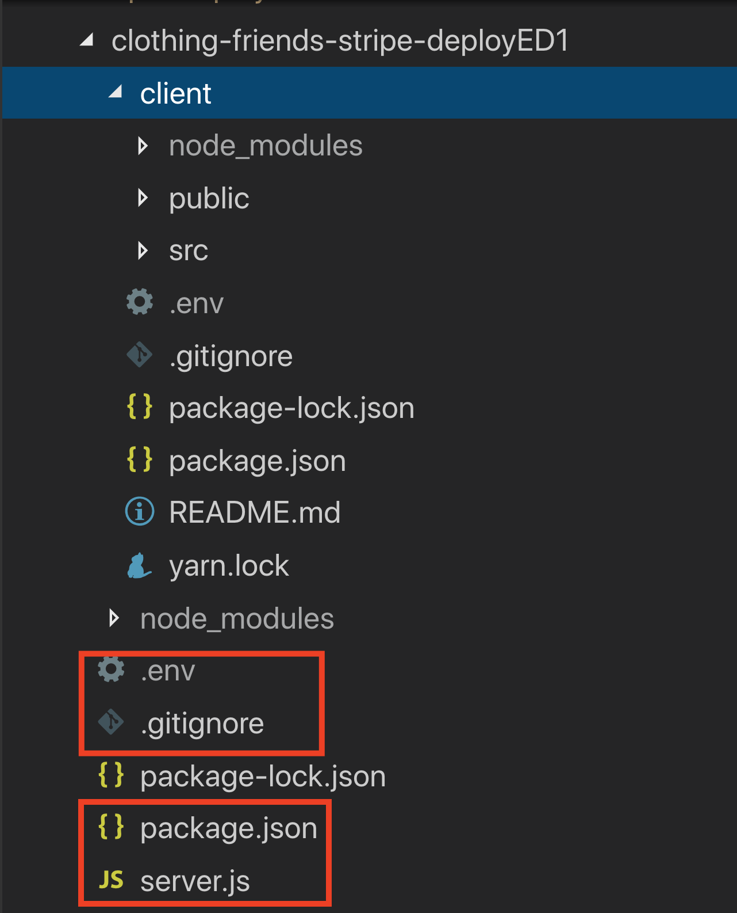
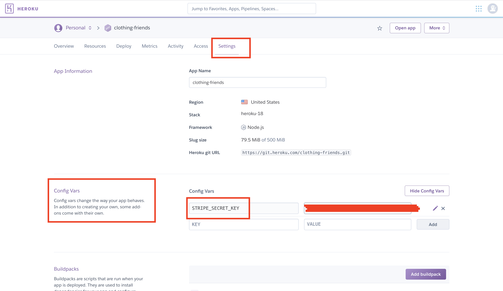
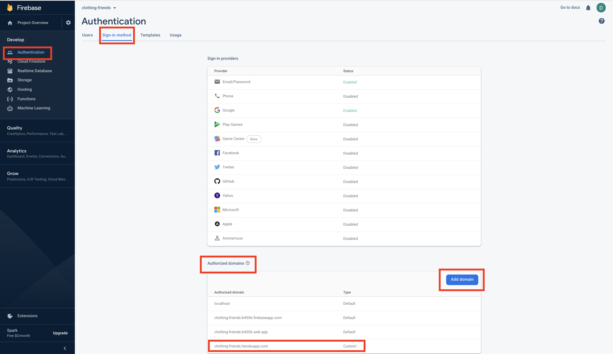

# Front end development tools (Part 4)

### `Key Words: heroku, stripe front end, stripe back end, full stack deploy, remove dependencies in production mode.`

- #### Click here: [BACK TO NAVIGASTION](https://github.com/DonghaoWu/Frontend-tools-demo/blob/master/README.md)

## `Section: Stripe and Heroku full-stack deploy.` (Basic)

### `Summary`: In this documentation, we learn to set stripe in both front end and back end, also deploy the full-stack application on Heroku.

### `Check Dependencies & Tools:`

- react-stripe-checkout
- axios

- dotenv
- cors
- express
- body-parser
- stripe

- concurrently
- nodemon
------------------------------------------------------------

#### `本章背景：`
1. Stripe 前端和后端设置。
2. Heroku 的全栈部署。

------------------------------------------------------------

### <span id="4.0">`Brief Contents & codes position`</span>

- #### Click here: [BACK TO NAVIGASTION](https://github.com/DonghaoWu/Frontend-tools-demo/blob/master/README.md)

- [4.1 Change the file structure to full-stack.](#4.1)
- [4.2 Set up Stripe front end.](#4.2)
- [4.3 Set up Stripe back end.](#4.3)
- [4.4 Set up other files.](#4.4)
- [4.5 Deploy on Heroku.](#4.5)

------------------------------------------------------------

### <span id="4.1">`Step1: Change the file structure to full-stack.`</span>

- #### Click here: [BACK TO CONTENT](#4.0)

1. Final files structure.

  <p align="center">
  
  </p>

  -----------------------------------------------------------------

### <span id="4.2">`Step2: Set up Stripe front end.`</span>

- #### Click here: [BACK TO CONTENT](#4.0)

1. Sign up in Stripe website and get the publishable key.

  <p align="center">
  
  </p>

  -----------------------------------------------------------------

2. Install dependencies.

    ```bach
    $ cd client
    $ npm i react-stripe-checkout axios
    ```

3. Add proxy in front end.

    __`Location:./clothing-friends-stripe-deployED1/client/package.json`__

    ```json
    "proxy": "http://localhost:5000"
    ```

4. :gem::gem::gem: Add a stripe button in front end and  __`apply the publishableKey here.`__

    __`Location:./clothing-friends-stripe-deployED1/client/src/Components/Stripe-button/Stripe-button.component.jsx`__

    ```jsx
    import React from 'react';
    import StripeCheckout from 'react-stripe-checkout';
    import axios from 'axios';

    const StripeCheckoutButton = ({ price }) => {
        const priceForStripe = price * 100;
        const publishableKey = 'pk_test_51HLupsCbpGGT0rI7hrSbq3oI4boGToq9OnsqjO6mwc3SKlApYWFZU2KkOlMwl1gSJmhxT20PUsfWXrM2XIuHEuJ50085O63Qvj';

        const onToken = token => {
            axios({
                url: 'payment',
                method: 'post',
                data: {
                    amount: priceForStripe,
                    token: token
                }
            })
                .then(response => {
                    alert('succesful payment');
                })
                .catch(error => {
                    console.log('Payment Error: ', error);
                    alert(
                        'There was an issue with your payment! Please make sure you use the provided credit card.'
                    );
                });
        };

        return (
            <StripeCheckout
                label='Pay Now'
                name='Clothing Friends.'
                billingAddress
                shippingAddress
                image='https://svgshare.com/i/CUz.svg'
                description={`Your total is $${price}`}
                amount={priceForStripe}
                panelLabel='Pay Now'
                token={onToken}
                stripeKey={publishableKey}
            />
        );
    };

    export default StripeCheckoutButton;
    ```

5. Add the stripe button into Checkout Page.

    __`Location:./clothing-friends-stripe-deployED1/client/src/Pages/CheckoutPage/CheckoutPage.component.jsx`__

    ```jsx
    import React from 'react';
    import { connect } from 'react-redux';
    import { createStructuredSelector } from 'reselect';

    import CheckoutItem from '../../Components/Checkout-item/Checkout-item.component';
    import StripeCheckoutButton from '../../Components/Stripe-button/Stripe-button.component';

    import { selectCartItems, selectCartTotal } from '../../redux/cart/cart.selectors';

    import './ChekcoutPage.styles.scss';

    const CheckoutPage = ({ cartItems, total }) => (
        <div className='checkout-page'>
            <div className='checkout-header'>
                <div className='header-block'>
                    <span>Product</span>
                </div>
                <div className='header-block'>
                    <span>Description</span>
                </div>
                <div className='header-block'>
                    <span>Quantity</span>
                </div>
                <div className='header-block'>
                    <span>Price</span>
                </div>
                <div className='header-block'>
                    <span>Remove</span>
                </div>
            </div>
            {cartItems.map(cartItem => (
                <CheckoutItem key={cartItem.id} cartItem={cartItem} />
            ))}
            <div className='total'>TOTAL: ${total}</div>
            <div className='test-warning'>
                *Please use the following test credit card for payments*
        <br />
                4242 4242 4242 4242 - Exp: 01/23 - CVV: 123
        </div>
            <StripeCheckoutButton price={total} />
        </div>
    );

    const mapStateToProps = createStructuredSelector({
        cartItems: selectCartItems,
        total: selectCartTotal
    });

    export default connect(mapStateToProps)(CheckoutPage);
    ```

6. Add some styles to the button.

    __`Location:./clothing-friends-stripe-deployED1/client/src/Pages/CheckoutPage/CheckoutPage.styles.scss`__
    
#### `Comment:`
1. 

### <span id="4.3">`Step3: Set up Stripe back end.`</span>

- #### Click here: [BACK TO CONTENT](#4.0)

  <p align="center">
  
  </p>

  -----------------------------------------------------------------

1. bash commands `<in app root directory>`:

```bash
$ npm init
$ npm i body-parser cors dotenv express stripe
$ npm i concurrently nodemon --save-dev
$ touch server.js
```

2. Edit your package.json. 

    __`Location:./clothing-friends-stripe-deployED1/package.json`__

    ```json
    {
        "name": "clothing-friends-server",
        "version": "1.0.0",
        "engines": {
            "node": "12.18.2",
            "npm": "6.14.5"
        },
        "scripts": {
            "client": "cd client && npm start",
            "server": "nodemon server.js",
            "build": "cd client && npm run build",
            "dev": "concurrently --kill-others-on-fail \"npm run server\" \"npm run client\"",
            "start": "node server.js",
            "heroku-postbuild": "cd client && npm install && npm install --only=dev --no-shrinkwrap && npm run build"
        },
        "dependencies": {
            "body-parser": "^1.19.0",
            "cors": "^2.8.5",
            "dotenv": "^8.2.0",
            "express": "^4.17.1",
            "stripe": "^8.90.0"
        },
        "devDependencies": {
            "concurrently": "^5.3.0",
            "nodemon": "^2.0.4"
        }
    }
    ```

    - 重点在 __`scripts`__.

3. Add .env file.

    __`Location:./clothing-friends-stripe-deployED1/.env`__

    ```js
    STRIPE_SECRET_KEY=<Your Stripe secret key>
    ```

4. Add .gitignore file.

    __`Location:./clothing-friends-stripe-deployED1/.gitignore`__

    ```json
    # See https://help.github.com/articles/ignoring-files/ for more about ignoring files.

    # dependencies
    /node_modules
    /.pnp
    .pnp.js

    # testing
    /coverage

    # production
    /build

    # misc
    .DS_Store
    .env.local
    .env.development.local
    .env.test.local
    .env.production.local

    npm-debug.log*
    yarn-debug.log*
    yarn-error.log*

    /.env
    ```

    - 重点在于 /.env, 这个文件用来保存开发时使用的 `Stripe secret key`，这样做的原因是不想 secret key 上传到 github，但又可以在本地开发使用。

    - 需要另外说明的是，这样做的原因跟 Heroku 无关，只适用于本地开发使用。

5. Edit server.js file

    __`Location:./clothing-friends-stripe-deployED1/server.js`__

    ```js
    const express = require('express');
    const cors = require('cors');
    const bodyParser = require('body-parser');
    const path = require('path');

    if (process.env.NODE_ENV !== 'production') require('dotenv').config();

    const stripe = require('stripe')(process.env.STRIPE_SECRET_KEY);

    const app = express();
    const port = process.env.PORT || 5000;

    app.use(bodyParser.json());
    app.use(bodyParser.urlencoded({ extended: true }));

    app.use(cors());

    if (process.env.NODE_ENV === 'production') {
        app.use(express.static(path.join(__dirname, 'client/build')));

        app.get('*', function (req, res) {
            res.sendFile(path.join(__dirname, 'client/build', 'index.html'));
        });
    }

    app.listen(port, error => {
        if (error) throw error;
        console.log('Server running on port ' + port);
    });

    app.post('/payment', (req, res) => {
        const body = {
            source: req.body.token.id,
            amount: req.body.amount,
            currency: 'usd'
        };

        stripe.charges.create(body, (stripeErr, stripeRes) => {
            if (stripeErr) {
                res.status(500).send({ error: stripeErr });
            } else {
                res.status(200).send({ success: stripeRes });
            }
        });
    });
    ```

#### `Comment:`
1. 

### <span id="4.4">`Step4: Set up other files.`</span>

- #### Click here: [BACK TO CONTENT](#4.0)

1. Replace with new favicon.

    __`Location:./clothing-friends-stripe-deployED1/public/favicon.ico`__

2. Change App index.html title tag.

    __`Location:./clothing-friends-stripe-deployED1/public/index.html`__

3. Remove redux-logger in production mode.

    __`Location:./clothing-friends-stripe-deployED1/src/redux/store.js`__

    ```js
    import { createStore, applyMiddleware } from 'redux';
    import { persistStore } from 'redux-persist';
    import logger from 'redux-logger';

    import rootReducer from './root-reducer';

    const middlewares = [];

    if (process.env.NODE_ENV === 'development') {
        middlewares.push(logger);
    }

    export const store = createStore(rootReducer, applyMiddleware(...middlewares));

    export const persistor = persistStore(store);

    export default { store, persistStore };
    ```

#### `Comment:`
1. 

### <span id="4.5">`Step5: Deploy on Heroku.`</span>

- #### Click here: [BACK TO CONTENT](#4.0)

1. Deploy on Heroku - `<In app root directory>`:

    ```bash
    $ git init
    $ heroku login
    $ heroku create <your app name>
    $ heroku git:remote -a <your app name>
    $ git add .
    $ git commit -m'something'
    $ git push heroku master --force
    ```

2. Add stripe secret key in Heroku.

  <p align="center">
  
  </p>

  -----------------------------------------------------------------

3. Add firebase Authorized domain.

  <p align="center">
  
  </p>

  -----------------------------------------------------------------

4. Unhide firebase publish api key.

#### `Comment:`
1. Other commands:
    ```diff
    + $ heroku apps
    + $ git remote
    ```

------------------------------------------------------------

__`本章用到的全部资料：`__

- null

- #### Click here: [BACK TO CONTENT](#4.0)
- #### Click here: [BACK TO NAVIGASTION](https://github.com/DonghaoWu/Frontend-tools-demo/blob/master/README.md)